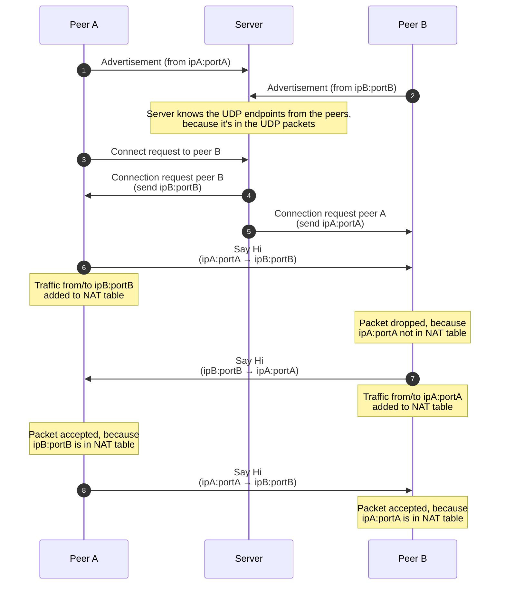

# Introduction
UHP tunnel stands for *UDP Hole Punching tunnel* and can be used to securely connect two peers with each other that can be behind a firewall or NAT router. UDP hole punching is a common technique that uses an intermediate server that connects both servers to each other without flowing all the traffic through the mediation server.

## How UDP hole punching works
[UDP hole punching](https://en.wikipedia.org/wiki/UDP_hole_punching) works, because it uses a side-effect of NAT routers to support UDP clients. Each UDP router maintains a mapping table between clients behind the NAT router and the outside world. UDP hole punching works, because the UDP router is tricked into believing that peers behind UDP routers communicate with each other.

1. Peer A advertises that it's available to the server.
2. Peer B advertises that it's available to the server.
3. Peer A requests a connection to peer B with the server.
4. The server checks if peer B is available by checking its internal administration and sends back the IP address and port number that peer B used to advertise itself.
5. The server also informs peer B that a connection request was made and sends the IP address and port number of peer B.
6. Peer A sends a packet to peer B. This will add ipB:portB to the NAT table of peer A's router, because it needs to forward the response to peer A.
7. The NAT router of peer B will drop the package, because it doesn't know about peer A.
8. Peer B sends a packet to peer A (because of the connection request from 5). This will add ipA:portA to the NAT table of peer B's router, because it also needs to forward the response to peer B.

At the end of this sequence, both peer A and peer B have updated NAT tables that allow traffic from each other. UDP packets can be send directly to the peer without passing the server.

## Secure communication
Hole punching is a nice side-effect of UDP, but the protocol has some additional challenges:
1. All data is sent in plain text.
2. No in-order delivery guarantee.
3. No multiplexing.
4. No keep-alive mechanism.

Fortunately, there is a protocol that works on top of UDP and does provide all this functionality and is called [QUIC](https://en.wikipedia.org/wiki/QUIC) (formerly an acronym for *Quick UDP Internet Connections*). QUIC is a client/server protocol, so one peer should act like a server and the other peer as a client. Because QUIC supports multiplexing, it is possible to tunnel multiple connections via a single UDP tunnel. This is especially useful when tunneling HTTP traffic that often requires a lot of parallel channels.

**IMPORTANT** The current method of exchanging certificates is not secure (all peer/server traffic is unencrypted) and is used to provide a proof-of-concept that UDP hole punching can be used. Using this in a production scenario requires a secure certificate exchange.

## UHP tunnel listeners
The UHP peer that is waiting for incoming connections needs to call the `listen` function. The peer generates a new private/public certificate pair and advertises the public certificate to the server. It will keep advertising the certificate at a fixed interval, so the server knows that the peer is still alive. If the server doesn't get advertisements from a peer anymore, then it will remove the peer from its administration.

## UHP tunnel clients
The UHP peer that wants to connect to another peer will call the `connect` function. The server will check its internal administration and send the connection requests to the peers. It will also send the listener peer's public certificate to the client. After the UDP hole punching sequence is complete, then it will connect using QUIC and accept only the public certificate that the client got from the server. All QUIC traffic will be encrypted.
